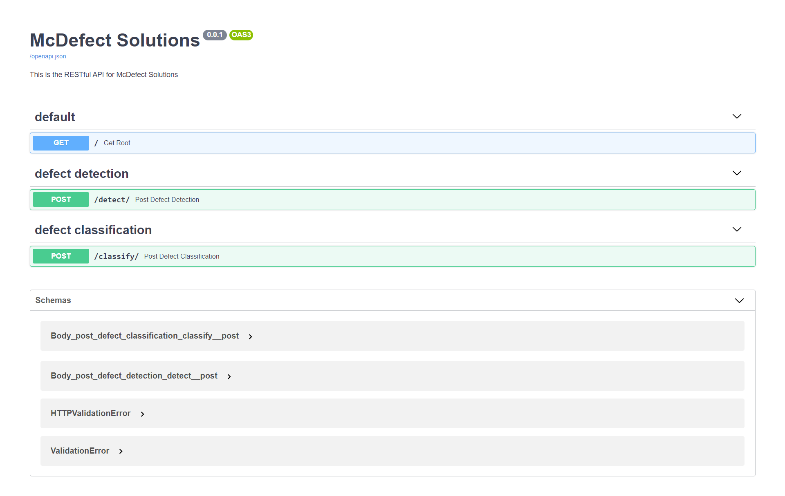

# RESTful API Server

This directory contains the code for the RESTful API Server for McDefect Solutions. The directory structure is as follows:

```bash
.
├── app
│   ├── __init__.py
│   ├── main.py
│   ├── models
│   │   ├── __init__.py
│   │   ├── DefectModels.py
│   │   └── ObjectModels.py
│   ├── routers
│   │   ├── __init__.py
│   │   ├── classify.py
│   │   └── detect.py
│   └── utils
│   │   ├── __init__.py
│   │   └── utils.py
└── requirements.txt
```

## Setup

1. Install all the necessary dependencies using `pip install -r requirements.txt`
2. Download the [`defect_detection_vgg16.hdf5`](https://drive.google.com/file/d/11o3l6DGXZf0Et1nvkaf0aSQHdGXsi8BU/view?usp=sharing) & [`defect_classification_vgg16.hdf5`](https://drive.google.com/file/d/1OdA9lB7lfvWxQZKCLMNvEmmXWchUbhuj/view?usp=sharing) models, & store them in the `app/models/` directory


## Usage

To start the server, use the following command:

```bash
$ cd app/
$ uvicorn main:app
```

This will start the server on `localhost:8000`

You can visit `http://localhost:8000` on the browser to check that the server is working. It should display `This is the RESTful API for McDefect Solutions`.

An interactive documentation of this API will be available on `http://localhost:8000/docs` (as shown below).




To start the server on a different port, type in:

```bash
$ uvicorn main:app --port <port_num>
```
